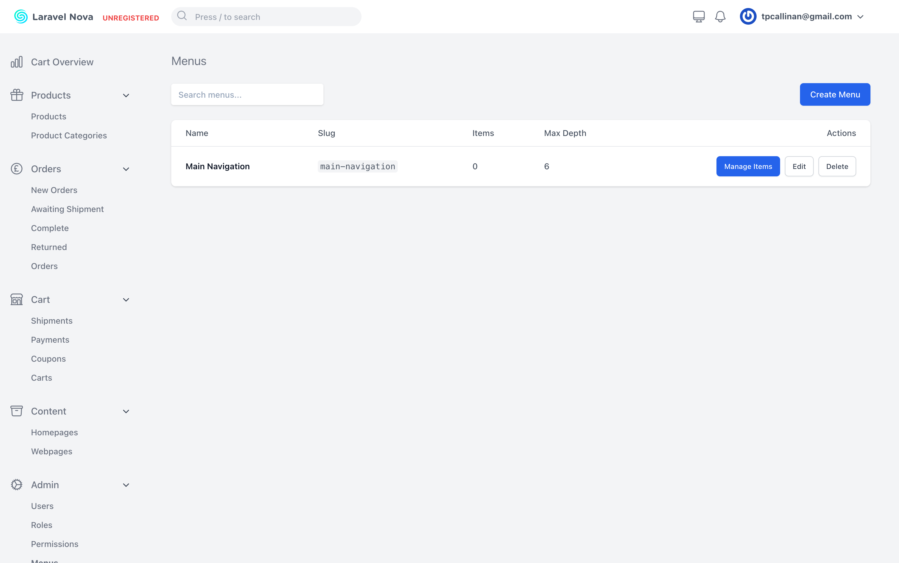
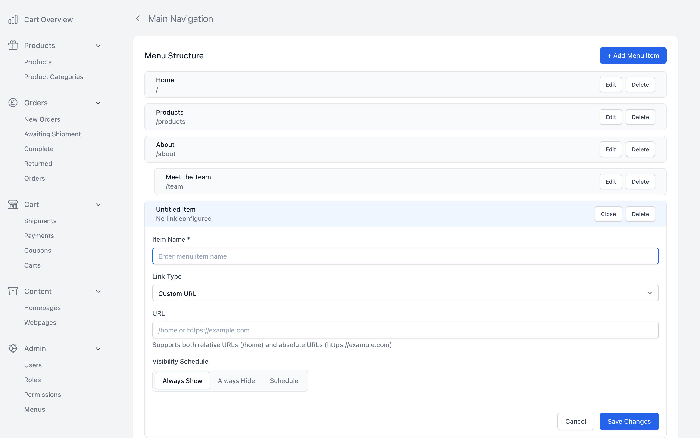

# Nova Menus

Advanced hierarchical menu management tool for Laravel Nova with drag-and-drop interface, temporal visibility, resource integration, and comprehensive testing.

## Screenshots


*Main menu management interface with Nova integration*


*Menu item management with hierarchical structure and edit controls*

## Features

- **🎯 Drag & Drop Interface**: Intuitive Vue.js-based interface with nested drag-and-drop functionality
- **⏰ Temporal Visibility**: Schedule menu items to appear/disappear at specific dates and times
- **🔗 Resource Integration**: Link menu items to any Nova resources with automatic URL generation
- **📊 Performance Monitoring**: Built-in query performance monitoring and optimization suggestions
- **🌳 Nested Hierarchy**: Unlimited nesting levels with configurable depth limits
- **✅ Comprehensive Testing**: 90%+ test coverage with unit, integration, and E2E tests
- **🎨 Responsive Design**: Mobile-friendly interface with accessibility support
- **⚡ Optimized Queries**: Efficient nested set implementation for fast hierarchy operations

## Requirements

- PHP 8.2+
- Laravel 10.0+
- Laravel Nova 4.0+ or 5.0+

## Installation

You can install the package via Composer:

```bash
composer require skylark-team/nova-menus
```

After installation, publish and run the migrations:

```bash
php artisan vendor:publish --tag="menus-migrations"
php artisan migrate
```

Optionally, you can publish the config file:

```bash
php artisan vendor:publish --tag="menus-config"
```

Register the tool in your `NovaServiceProvider`:

```php
use Skylark\Menus\MenusTool;

public function tools()
{
    return [
        new MenusTool(),
    ];
}
```

## Usage

### Basic Menu Management

1. **Access the Tool**: Navigate to "Menus" in your Nova sidebar
2. **Create a Menu**: Click "Create Menu" and provide a name and slug
3. **Add Items**: Use "Manage Items" to add menu items with drag-and-drop functionality
4. **Configure Links**: Set custom URLs or link to Nova resources
5. **Set Visibility**: Configure when items should be visible (always, never, or scheduled)

### Programmatic Usage

#### Creating Menus Programmatically

```php
use Skylark\Menus\Models\MenuItem;

// Create a root menu
$menu = MenuItem::create([
    'name' => 'Main Navigation',
    'slug' => 'main-nav',
    'is_root' => true,
    'max_depth' => 6,
]);

// Add menu items
$homeItem = MenuItem::create([
    'menu_id' => $menu->id,
    'name' => 'Home',
    'custom_url' => '/',
    'position' => 1,
]);

$aboutItem = MenuItem::create([
    'menu_id' => $menu->id,
    'name' => 'About',
    'custom_url' => '/about',
    'position' => 2,
]);
```

#### Retrieving Menu Data

```php
// Get a menu with all items
$menu = MenuItem::where('slug', 'main-nav')->first();
$items = $menu->children()->visible()->ordered()->get();

// Get hierarchical structure
$tree = MenuItem::where('menu_id', $menu->id)
    ->with('children.children')
    ->whereNull('parent_id')
    ->ordered()
    ->get();
```

#### Visibility Filtering

```php
use Carbon\Carbon;

// Get currently visible items
$visibleItems = MenuItem::visible()->get();

// Get items visible at specific time
$futureDate = Carbon::parse('2024-12-25 00:00:00');
$christmasItems = MenuItem::isVisibleAt($futureDate)->get();

// Create scheduled item
MenuItem::create([
    'name' => 'Holiday Special',
    'custom_url' => '/holiday',
    'display_at' => '2024-12-01 00:00:00',
    'hide_at' => '2024-12-31 23:59:59',
]);
```

### Frontend Integration

#### Blade Templates

```php
@php
$menu = \Skylark\Menus\Models\MenuItem::where('slug', 'main-nav')->first();
$items = $menu ? $menu->children()->visible()->ordered()->get() : collect();
@endphp

<nav class="main-navigation">
    @foreach ($items as $item)
        <a href="{{ $item->getUrl() }}" 
           class="nav-item {{ $item->isCurrentPage() ? 'active' : '' }}">
            {{ $item->name }}
        </a>
        
        @if ($item->children->isNotEmpty())
            <ul class="nav-submenu">
                @foreach ($item->children as $child)
                    <li>
                        <a href="{{ $child->getUrl() }}">{{ $child->name }}</a>
                    </li>
                @endforeach
            </ul>
        @endif
    @endforeach
</nav>
```

#### API Usage

```php
// In your controller
public function getMenu($slug)
{
    $menu = MenuItem::where('slug', $slug)->first();
    
    if (!$menu) {
        return response()->json(['error' => 'Menu not found'], 404);
    }
    
    $tree = $menu->children()
        ->visible()
        ->with(['children' => function ($query) {
            $query->visible()->ordered();
        }])
        ->ordered()
        ->get();
    
    return response()->json($tree);
}
```

## Configuration

The config file allows you to customize various aspects of the menu system:

```php
return [
    // Maximum nesting depth
    'max_depth' => 10,
    
    // Performance monitoring
    'performance_monitoring' => env('MENUS_PERFORMANCE_MONITORING', false),
    'slow_query_threshold' => 100, // milliseconds
    'log_slow_queries' => env('MENUS_LOG_SLOW_QUERIES', false),
    
    // Resource integration
    'resources' => [
        'App\\Models\\Page' => [
            'model' => 'App\\Models\\Page',
            'name_field' => 'title',
            'slug_field' => 'slug',
            'route_pattern' => '/pages/{slug}',
        ],
        // Add more resource types...
    ],
    
    // Cache settings
    'cache' => [
        'enabled' => true,
        'ttl' => 3600, // 1 hour
        'key_prefix' => 'menus',
    ],
];
```

## Performance Optimization

### Database Optimization

The package includes performance monitoring tools:

```bash
# Analyze query performance
php artisan menus:analyze-performance

# Generate optimization recommendations
php artisan menus:analyze-performance --threshold=50 --export=performance-report.json
```

### Recommended Database Indexes

For optimal performance, ensure these indexes exist:

```sql
-- Basic indexes
CREATE INDEX idx_menu_items_menu_id ON menu_items(menu_id);
CREATE INDEX idx_menu_items_parent_id ON menu_items(parent_id);
CREATE INDEX idx_menu_items_position ON menu_items(position);

-- Composite indexes for better performance
CREATE INDEX idx_menu_items_menu_parent ON menu_items(menu_id, parent_id);
CREATE INDEX idx_menu_items_parent_position ON menu_items(parent_id, position);
CREATE INDEX idx_menu_items_visibility ON menu_items(is_active, display_at, hide_at);

-- Nested set indexes (if using nested set model)
CREATE INDEX idx_menu_items_lft_rgt ON menu_items(lft, rgt);
```

### Caching

Enable caching for frequently accessed menus:

```php
use Skylark\Menus\Models\MenuItem;

// Cache menu for 1 hour
$menu = Cache::remember("menu.{$slug}", 3600, function () use ($slug) {
    return MenuItem::where('slug', $slug)
        ->with(['children' => function ($query) {
            $query->visible()->ordered();
        }])
        ->first();
});
```

## Testing

The package includes comprehensive tests covering unit, integration, and end-to-end scenarios:

```bash
# Run all tests
composer test

# Run with coverage
composer test-coverage

# Run specific test types
vendor/bin/pest tests/Unit
vendor/bin/pest tests/Feature
vendor/bin/pest tests/Performance

# Run E2E tests with Playwright
npm run test:e2e
```

### Test Categories

- **Unit Tests**: Model validation, service logic, utilities
- **Feature Tests**: API endpoints, database operations, Nova integration
- **Performance Tests**: Large dataset handling, query optimization
- **Vue Component Tests**: Frontend component functionality
- **E2E Tests**: Complete user workflows with Playwright

## Development

### Setting Up Development Environment

```bash
# Clone the repository
git clone https://github.com/skylark-team/nova-menus.git
cd nova-menus

# Install dependencies
composer install
npm install

# Set up testing environment
cp .env.example .env
php artisan key:generate
php artisan migrate --database=testing

# Run development server
composer run dev
```

### Code Quality

```bash
# Format code
composer format

# Check code style
composer lint

# Run static analysis
composer analyse

# Run all quality checks
composer test && composer lint && composer analyse
```

## API Reference

### Model Methods

#### MenuItem Model

```php
// Hierarchy methods
$item->children()           // Get direct children
$item->descendants          // Get all descendants
$item->ancestors           // Get all ancestors
$item->siblings()          // Get siblings

// Visibility methods
MenuItem::visible()        // Scope for visible items
MenuItem::isVisibleAt($date) // Scope for items visible at date
$item->isCurrentlyVisible() // Check if item is visible now

// Utility methods
$item->getUrl()           // Get the item URL
$item->isCurrentPage()    // Check if item matches current page
$item->hasChildren()      // Check if item has children
```

### Service Classes

#### QueryPerformanceMonitor

```php
use Skylark\Menus\Services\QueryPerformanceMonitor;

$monitor = new QueryPerformanceMonitor();

// Monitor specific operation
$stats = $monitor->monitor(function () {
    return MenuItem::with('children')->get();
});

// Get optimization suggestions
$suggestions = $monitor->getMenuOptimizationSuggestions();
```

## Contributing

Please see [CONTRIBUTING.md](CONTRIBUTING.md) for details.

## Security Vulnerabilities

Please review our [security policy](../../security/policy) on how to report security vulnerabilities.

## Changelog

Please see [CHANGELOG.md](CHANGELOG.md) for more information on what has changed recently.

## License

The MIT License (MIT). Please see [License File](LICENSE.md) for more information.

## Credits

- [Skylark Team](https://github.com/skylark-team)

## Support

If you discover any issues or have questions, please:

1. Check the [documentation](https://skylark-team.github.io/nova-menus)
2. Search [existing issues](https://github.com/skylark-team/nova-menus/issues)
3. Create a [new issue](https://github.com/skylark-team/nova-menus/issues/new) if needed

For commercial support, please contact us at [info@skylark.dev](mailto:info@skylark.dev).